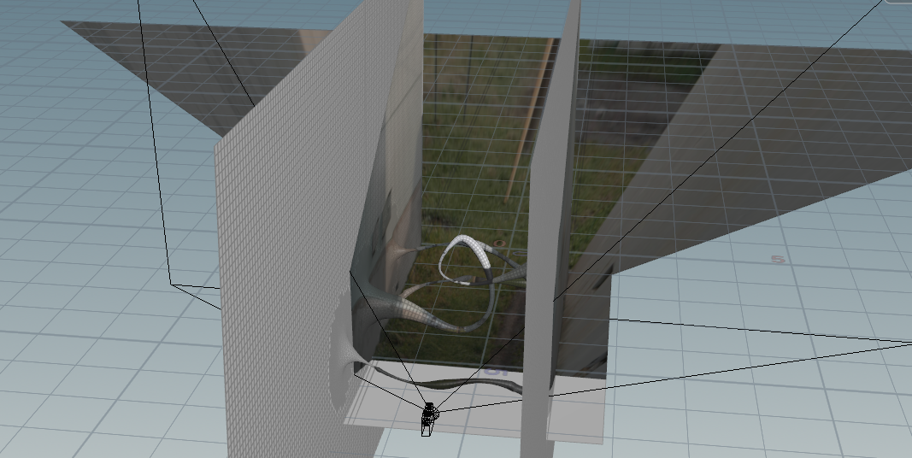

# Houdini Camera Projection Shader v3



A GLSL shader for Houdini to support camera projection texturing in a viewport. Unlike UV mapping with UV Texture SOP's Prrspective From Camera,, this method also works for low-poly model without any glitches or distortion since it preserves a camera's projection matrix and computes the UV in the fragment phase. It would be useful for compositing live action or image-based modeling.

## Input attributes

You have to manually set the attributes shown the below vex snippet in a SOP context to pass them to the shader program.

```c++
// Detail attributes that hold projection matrix
string campath = chs("cam");

matrix xform = invert(optransform(campath));

v@cam_axisy = set(getcomp(xform, 1, 0), getcomp(xform, 1, 1), getcomp(xform, 1, 2));
v@cam_axisz = set(getcomp(xform, 2, 0), getcomp(xform, 2, 1), getcomp(xform, 2, 2));
v@cam_trans = set(getcomp(xform, 3, 0), getcomp(xform, 3, 1), getcomp(xform, 3, 2));

@cam_aspect = chf(campath + "/resx") / chf(campath + "/resy");
@cam_zoom = chf(campath + "/focal") / chf(campath + "/aperture");

// Set rest as a point attribute (you can use Rest SOP)
@rest = @P;
```

## Known Issue

- Very slow on macOS Big Sur (w/ 18.5.408)

## License

The MIT License (MIT)

Copyright (c) 2021 Baku Hashimoto

Permission is hereby granted, free of charge, to any person obtaining a copy
of this software and associated documentation files (the "Software"), to deal
in the Software without restriction, including without limitation the rights
to use, copy, modify, merge, publish, distribute, sublicense, and/or sell
copies of the Software, and to permit persons to whom the Software is
furnished to do so, subject to the following conditions:

The above copyright notice and this permission notice shall be included in all
copies or substantial portions of the Software.

THE SOFTWARE IS PROVIDED "AS IS", WITHOUT WARRANTY OF ANY KIND, EXPRESS OR
IMPLIED, INCLUDING BUT NOT LIMITED TO THE WARRANTIES OF MERCHANTABILITY,
FITNESS FOR A PARTICULAR PURPOSE AND NONINFRINGEMENT. IN NO EVENT SHALL THE
AUTHORS OR COPYRIGHT HOLDERS BE LIABLE FOR ANY CLAIM, DAMAGES OR OTHER
LIABILITY, WHETHER IN AN ACTION OF CONTRACT, TORT OR OTHERWISE, ARISING FROM,
OUT OF OR IN CONNECTION WITH THE SOFTWARE OR THE USE OR OTHER DEALINGS IN THE
SOFTWARE.
